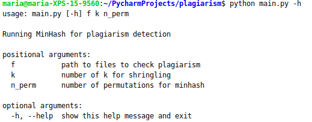

# Plagiarism detection system for texts
Task from MMDS course.

## Data
* Corpus link: https://ir.shef.ac.uk/cloughie/resources/plagiarism_corpus.html 

## Run
Command to run script: 
python main.py './corpus' 2 10

Parameters: 
 
